# cloudfront-s3-global-static-website

A simple hands-on AWS project that demonstrates how to host a private static website on Amazon S3 and deliver it globally using Amazon CloudFront.

---

## 📌 Project Overview

This project shows how to:
- Host a static website securely in **Amazon S3**
- Deliver content globally using **Amazon CloudFront**
- Keep the S3 bucket **private** using **Origin Access Control (OAC)**
- Configure **custom cache policies**
- Understand **cache hit / cache miss**
- Use **cache invalidation** to update content

The project is intentionally kept simple and cost-effective and was built using the **AWS Free Tier** where possible.

---

## 🗂 Project Structure

```
cloudfront-s3-global-static-website/
├── screenshots/
├── website/
│   ├── index.html
│   └── style.css
└── README.md
```

---

## 🛠 Services Used

- Amazon S3
- Amazon CloudFront
- AWS Identity and Access Management (IAM)

---

## 🚀 Deployment Steps (High Level)

### 1. Create an S3 bucket
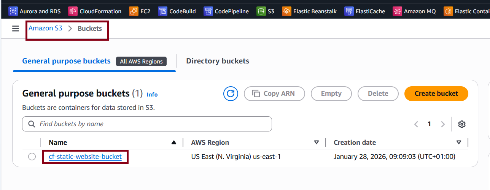

### 2. Upload website files
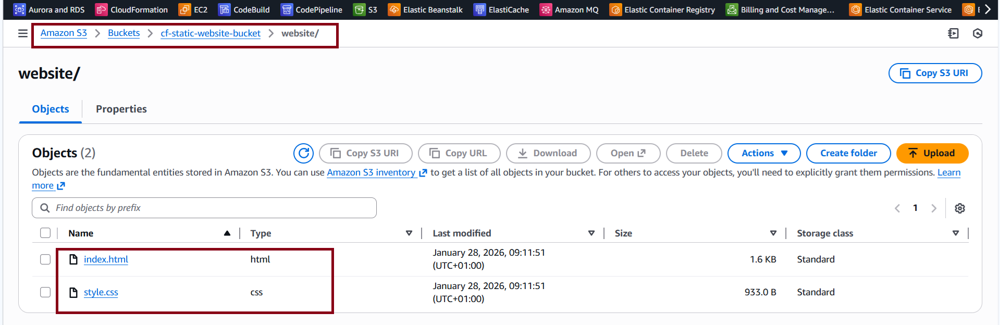

### 3. Create CloudFront distribution
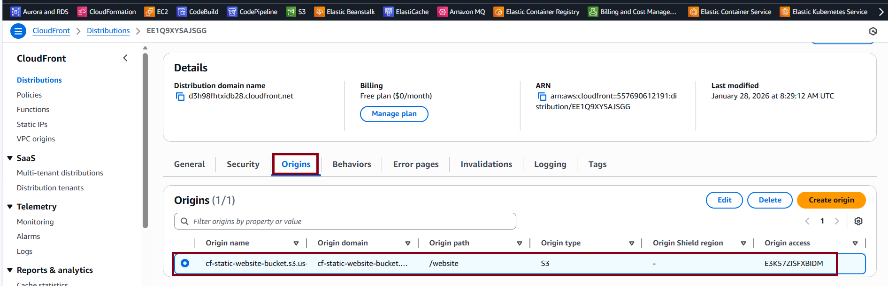

### 4. Configure Origin Access Control (OAC)
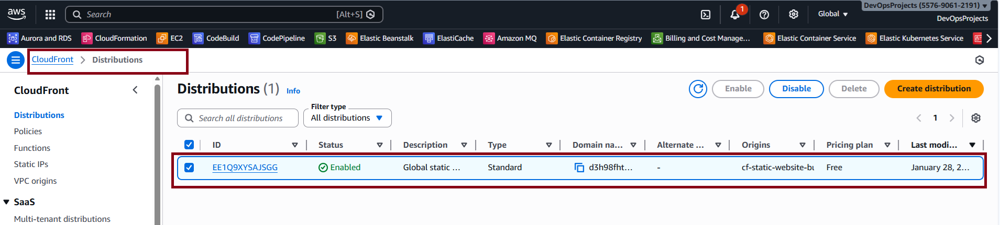

### 5. Apply S3 bucket policy for OAC
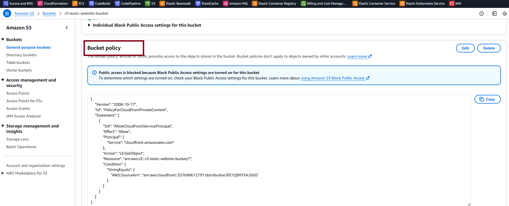

### 6. Access the website via CloudFront
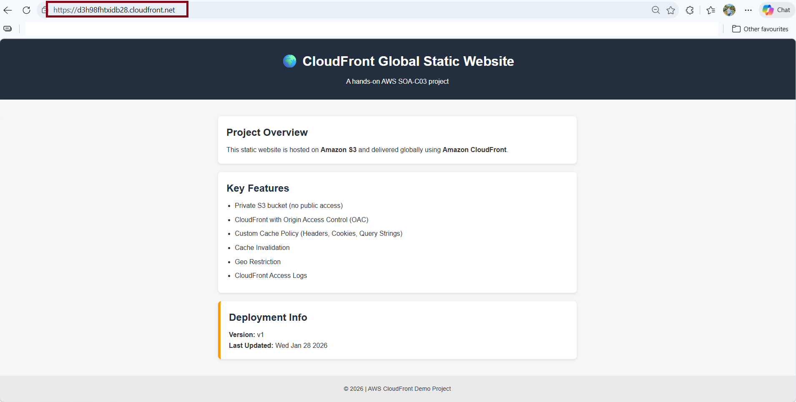

### 7. Create a custom cache policy
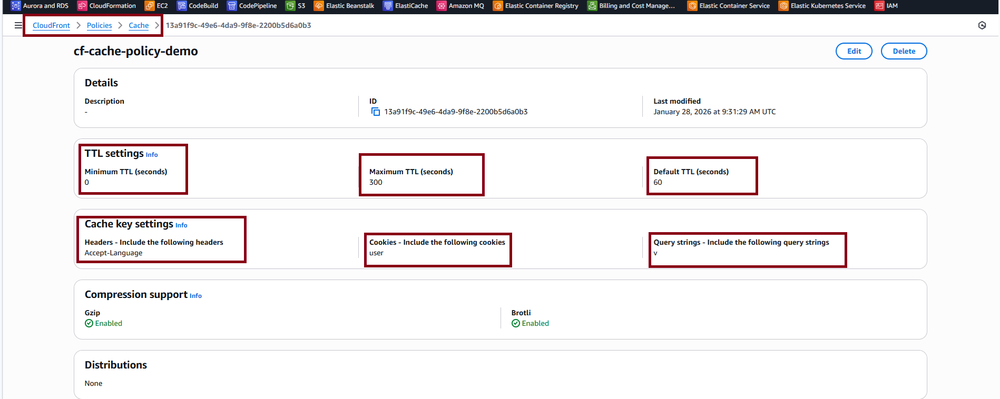
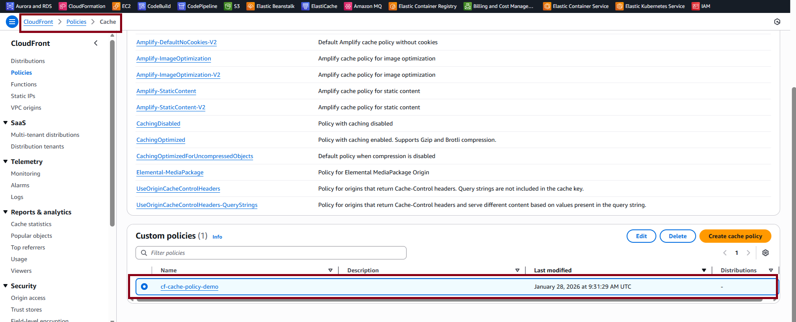

### 8. Verify cache behavior
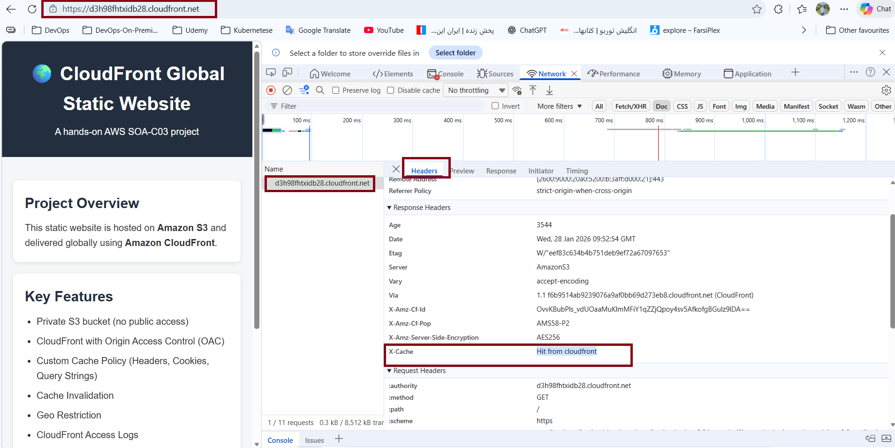

### 9. Perform cache invalidation
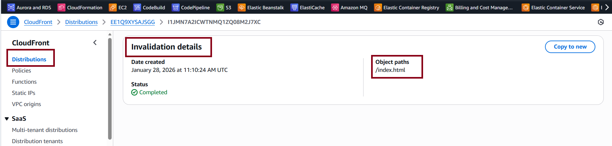

### 10. Verify updated content
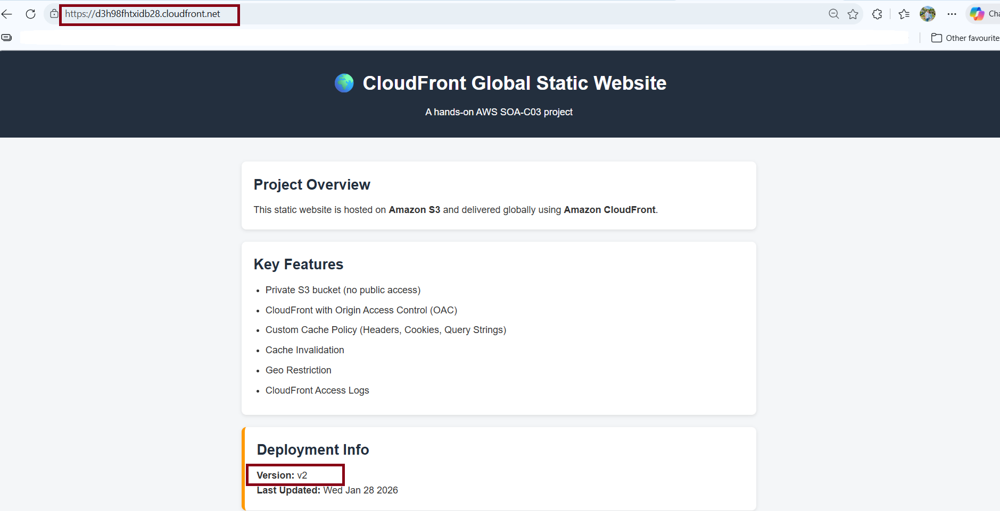

---

## 📦 Features Implemented

- Private S3 bucket (no public access)
- CloudFront with Origin Access Control (OAC)
- Custom cache policy
- Cache invalidation
- Global content delivery

---

## ⚠️ Free Tier Limitations

Some CloudFront features were not available due to the Free plan:
- Geo Restriction
- CloudFront standard access logs
- Real-time logging
- Advanced WAF features

---

## 🔮 Future Improvements

- Enable Geo Restriction
- Enable CloudFront access logs
- Add AWS WAF
- Use custom domain with SSL
- Automate with Terraform
- Add CI/CD pipeline

---
CloudFront distributions cannot be deleted immediately after canceling a pricing plan. AWS enforces a billing-cycle boundary even for the Free plan.

